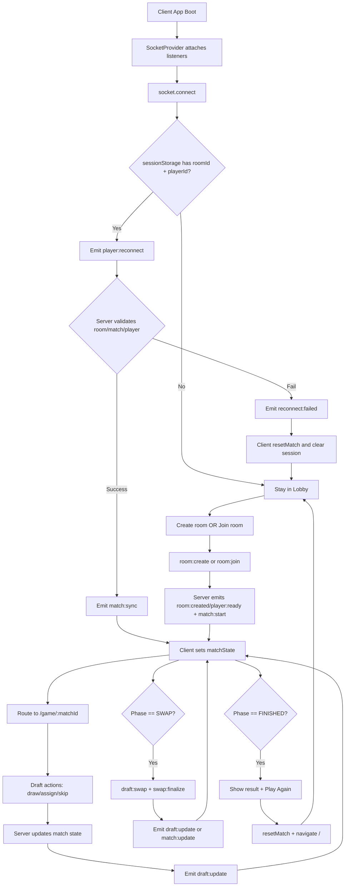
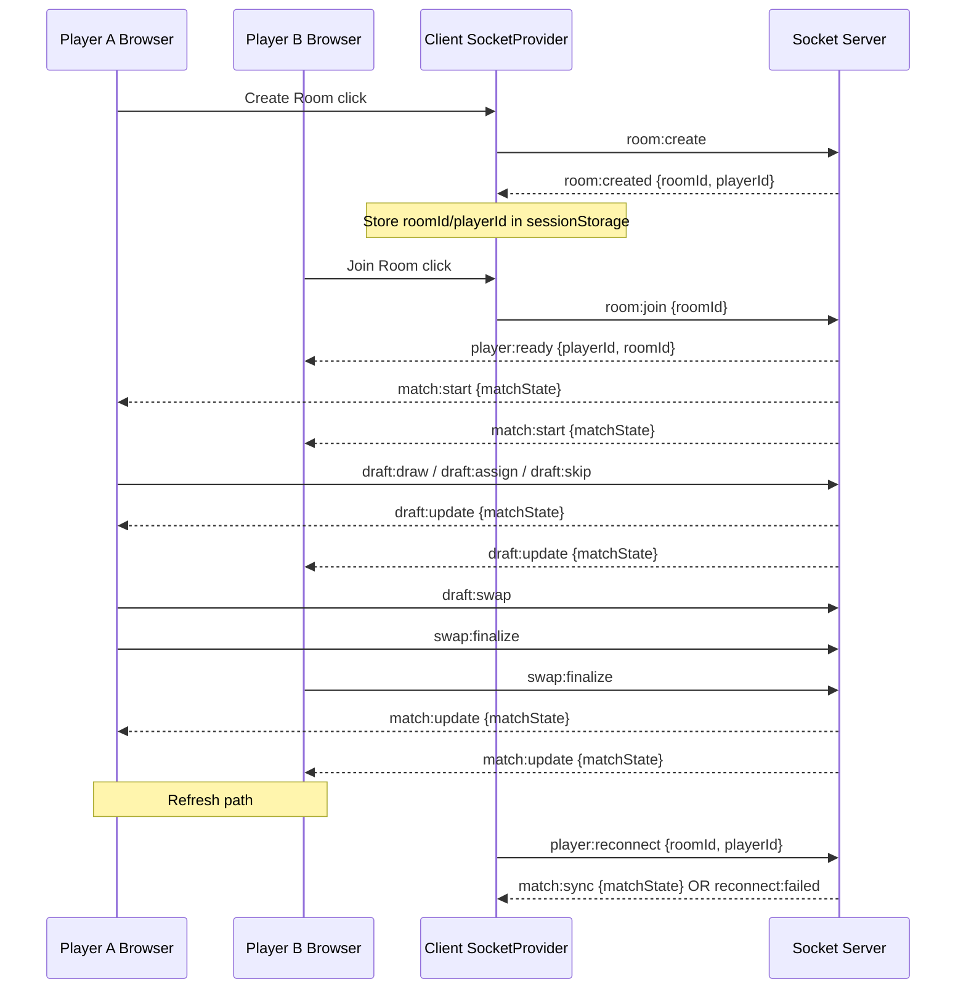
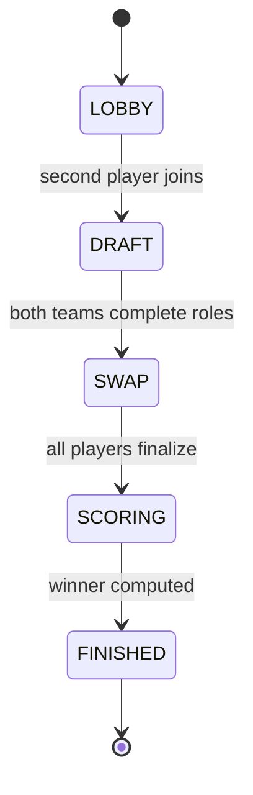

# Drafter 2 - Complete Flow, Events, and Data Contracts

This document explains the full project flow (client + server), all socket events, what each event reads/writes, and the main entity types.

## 1) High-Level Runtime Flow

## 2) Socket Event Inventory

### Active server-side handled events (`socket.on`)

Total active handlers: **9**

1. `room:create`
2. `room:join`
3. `player:reconnect`
4. `draft:draw`
5. `draft:assign`
6. `draft:skip`
7. `draft:swap`
8. `swap:finalize`
9. `disconnect`

Note: `match:get` exists in `server/sockets/matchHandlers.ts` but is not currently registered in `socketRegistry.ts`.

### Server -> client emitted events

Total distinct outgoing server events: **8**

1. `room:created`
2. `player:ready`
3. `match:start`
4. `match:sync`
5. `draft:update`
6. `match:update`
7. `reconnect:failed`
8. `error`

### Client -> server emitted events

Total distinct outgoing client events: **8**

1. `room:create`
2. `room:join`
3. `player:reconnect`
4. `draft:draw`
5. `draft:assign`
6. `draft:skip`
7. `draft:swap`
8. `swap:finalize`

## 3) Event Contract and Effect Matrix

| Event              | Direction        | Payload In             | Server/Client Action                                                    | Payload Out                                                                      |
| ------------------ | ---------------- | ---------------------- | ----------------------------------------------------------------------- | -------------------------------------------------------------------------------- |
| `room:create`      | Client -> Server | none                   | Create room + create match + add first player + map socket              | `room:created { roomId, playerId }`                                              |
| `room:join`        | Client -> Server | `{ roomId }`           | Join existing room + add second player + start draft if 2 players       | `player:ready { playerId, roomId }`, room broadcast `match:start { matchState }` |
| `player:reconnect` | Client -> Server | `{ roomId, playerId }` | Validate identity, rebind socket mappings, join room                    | `match:sync { matchState }` or `reconnect:failed { message }`                    |
| `draft:draw`       | Client -> Server | none                   | Validate turn/phase, draw to current player's pending card              | room broadcast `draft:update { matchState }`                                     |
| `draft:assign`     | Client -> Server | `{ role }`             | Assign pending card to role, switch turn, maybe end draft               | room broadcast `draft:update { matchState }`                                     |
| `draft:skip`       | Client -> Server | none                   | Consume one skip, redraw pending card                                   | room broadcast `draft:update { matchState }`                                     |
| `draft:swap`       | Client -> Server | `{ roleA, roleB }`     | Swap team slots during SWAP phase                                       | room broadcast `draft:update { matchState }`                                     |
| `swap:finalize`    | Client -> Server | none                   | Mark player done in SWAP, maybe finish scoring                          | room broadcast `match:update { matchState }`                                     |
| `disconnect`       | Socket transport | none                   | Remove socket from room map + player map (with reconnect grace on room) | none                                                                             |
| `error`            | Server -> Client | `{ message }`          | Client logs; resets only for identity-critical failures                 | none                                                                             |

## 4) Route + UI Flow

## 5) Core Entity Types (What They Contain)

### `Card`

- `id: string`
- `name: string`
- `anime: string`
- `image: string`
- `stats: Record<Role, number>`

### `Player`

- `id: string` (stable player identity for a match)
- `socketId: string` (current connected socket)
- `skipUsed: boolean`
- `hasSwapped: boolean`
- `team: Partial<Record<Role, Card>>`
- `pendingCard: Card | null`
- `totalScore?: number`

### `MatchState`

- `id: string`
- `phase: "LOBBY" | "DRAFT" | "SWAP" | "SCORING" | "FINISHED"`
- `deck: Card[]`
- `players: Player[]`
- `currentTurnPlayerId: string | null`
- `winner: string | null`

### `Room` (server service internal)

- `id: string`
- `matchId: string`
- `players: string[]` (socket IDs in the room)

## 6) Server State Stores and Their Writes

### `roomService`

- `rooms: Map<roomId, Room>`
- `socketToRoom: Map<socketId, roomId>`

Writes happen in:

- `createRoom` (new room + first socket mapping)
- `joinRoom` (append socket + mapping)
- `rebindSocket` (replace old socket with new on reconnect)
- `removePlayer` (remove socket mapping, delayed empty-room cleanup)

### `playerService`

- `socketToPlayer: Map<socketId, playerId>`
- `playerToSocket: Map<playerId, socketId>`

Writes happen in:

- `registerPlayer` (bind/rebind player identity to current socket)
- `removePlayer` (remove socket mapping; only clear reverse map if still same socket)

### `matchService`

- `matches: Map<matchId, Match>`

Writes happen in:

- `createMatch`
- `removeMatch`

## 7) Match State Transitions

## 8) Practical Notes

- Session identity is tab-scoped (`sessionStorage`) to avoid two tabs sharing one `playerId`.
- Reconnect requires both `roomId` and `playerId`; otherwise client stays in lobby mode.
- If reconnect fails (`reconnect:failed`), client clears session state and returns to clean flow.
- Current game route uses `/game/:roomId` but navigates with `matchState.id` (match id). This works because `GamePage` reads state from context, not URL parameter.
