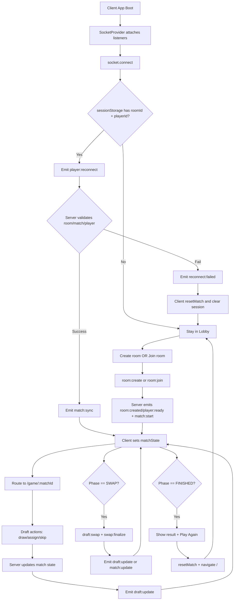
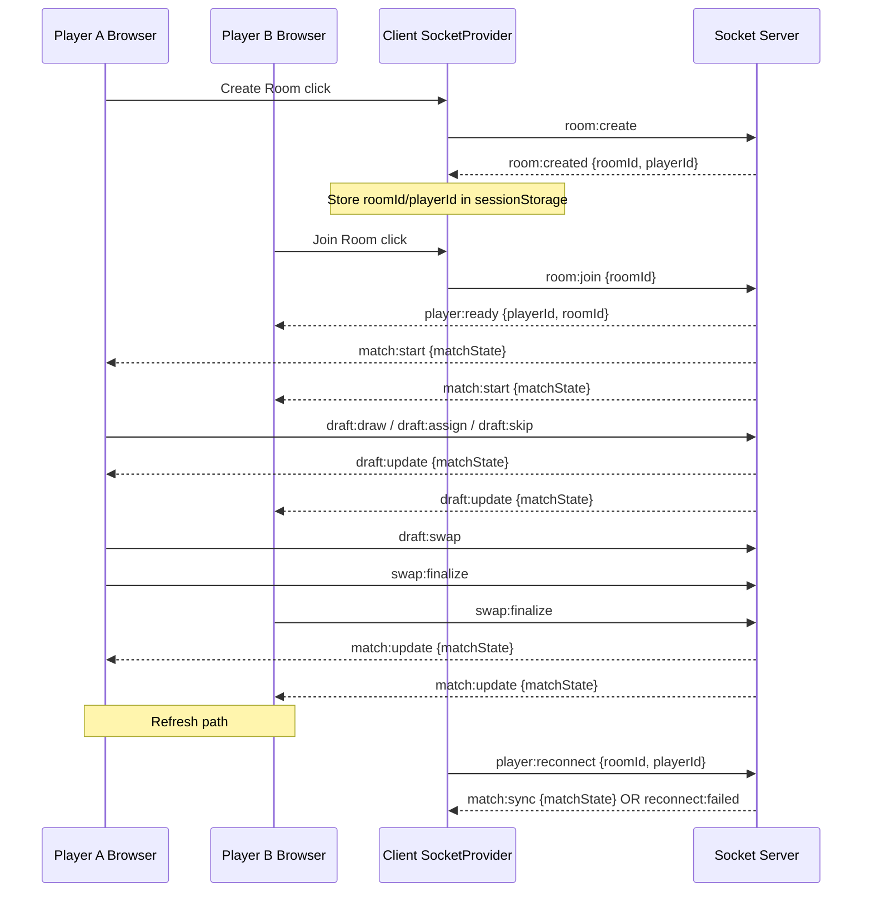
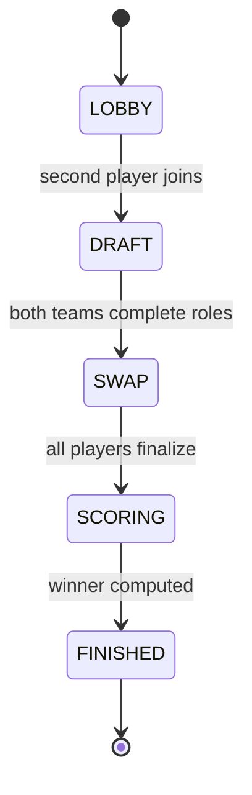

# Drafter 2 - Complete Flow, Events, and Data Contracts

This document explains the full project flow (client + server), all socket events, what each event reads/writes, and the main entity types.

## 0) Working Log (Ongoing)

Last updated: **2026-03-11**

### Timeline updates

- **2026-03-11:** Added canonical entity inventory and proposed PostgreSQL schema blueprint (hybrid relational + JSONB) for upcoming DB migration.
- **2026-03-11:** Stabilization pass completed on server state ownership.
- Added repository abstraction layer at `server/repositories` with in-memory adapters.
- `roomService`, `matchService`, and `playerService` now depend on repository interfaces via repository instances, making DB migration straightforward.
- Server build validated successfully after refactor (`npm run build`).

### Current implemented state

- End-to-end 2-player draft flow is implemented: lobby/create/join, draft, swap, scoring, and finish.
- Reconnect flow is implemented with identity validation using `roomId + playerId` and socket rebind.
- Client receives state from `match:start`, `draft:update`, `match:update`, and `match:sync`.
- Server-side active socket handlers are currently `room:create`, `room:join`, `room:destroy`, `player:reconnect`, `draft:draw`, `draft:assign`, `draft:skip`, `draft:swap`, `swap:finalize`, `match:get`, `match:exit`, and `disconnect`.

### Known implementation notes

- Game route parameter currently differs from navigation payload (`/game/:roomId` route while navigation uses `matchState.id`), and the page relies on context state.

### Current architecture snapshot (server)

- **Transport layer:** `server/sockets/*` (event parsing, emit, and socket lifecycle hooks).
- **Application layer:** `server/services/*` (room/match/player orchestration).
- **Domain layer:** `server/game/*` (rules, scoring, deck, match state transitions).
- **Persistence layer (pluggable):** `server/repositories/*` (currently in-memory, DB adapters next).

### Update rule for this file

- Append a dated bullet under this section whenever a feature, contract, or behavior changes.
- Keep event names and payload contracts aligned with actual socket handler code.
- Keep this document as the source-of-truth snapshot of current project behavior.

## 1) High-Level Runtime Flow

## 2) Socket Event Inventory

### Active server-side handled events (`socket.on`)

Total active handlers: **12**

1. `room:create`
2. `room:join`
3. `room:destroy`
4. `player:reconnect`
5. `draft:draw`
6. `draft:assign`
7. `draft:skip`
8. `draft:swap`
9. `swap:finalize`
10. `match:get`
11. `match:exit`
12. `disconnect`

### Server -> client emitted events

Total distinct outgoing server events: **10**

1. `room:created`
2. `player:ready`
3. `match:start`
4. `match:sync`
5. `draft:update`
6. `match:update`
7. `room:destroyed`
8. `match:ended`
9. `reconnect:failed`
10. `error`

### Client -> server emitted events

Total distinct outgoing client events: **11**

1. `room:create`
2. `room:join`
3. `room:destroy`
4. `player:reconnect`
5. `draft:draw`
6. `draft:assign`
7. `draft:skip`
8. `draft:swap`
9. `swap:finalize`
10. `match:get`
11. `match:exit`

## 3) Event Contract and Effect Matrix

| Event              | Direction        | Payload In             | Server/Client Action                                                    | Payload Out                                                                      |
| ------------------ | ---------------- | ---------------------- | ----------------------------------------------------------------------- | -------------------------------------------------------------------------------- |
| `room:create`      | Client -> Server | none                   | Create room + create match + add first player + map socket              | `room:created { roomId, playerId }`                                              |
| `room:join`        | Client -> Server | `{ roomId }`           | Join existing room + add second player + start draft if 2 players       | `player:ready { playerId, roomId }`, room broadcast `match:start { matchState }` |
| `room:destroy`     | Client -> Server | none                   | Host closes room and tears match down                                   | room broadcast `room:destroyed { message }`                                      |
| `player:reconnect` | Client -> Server | `{ roomId, playerId }` | Validate identity, rebind socket mappings, join room                    | `match:sync { matchState }` or `reconnect:failed { message }`                    |
| `draft:draw`       | Client -> Server | none                   | Validate turn/phase, draw to current player's pending card              | room broadcast `draft:update { matchState }`                                     |
| `draft:assign`     | Client -> Server | `{ role }`             | Assign pending card to role, switch turn, maybe end draft               | room broadcast `draft:update { matchState }`                                     |
| `draft:skip`       | Client -> Server | none                   | Consume one skip, redraw pending card                                   | room broadcast `draft:update { matchState }`                                     |
| `draft:swap`       | Client -> Server | `{ roleA, roleB }`     | Swap team slots during SWAP phase                                       | room broadcast `draft:update { matchState }`                                     |
| `swap:finalize`    | Client -> Server | none                   | Mark player done in SWAP, maybe finish scoring                          | room broadcast `match:update { matchState }`                                     |
| `match:get`        | Client -> Server | none                   | Request current authoritative state snapshot                            | `match:update { matchState }`                                                    |
| `match:exit`       | Client -> Server | none                   | Exit current match and notify both players                              | `match:ended { message }`                                                        |
| `disconnect`       | Socket transport | none                   | Remove socket from room map + player map (with reconnect grace on room) | none                                                                             |
| `error`            | Server -> Client | `{ message }`          | Client logs; resets only for identity-critical failures                 | none                                                                             |

## 4) Route + UI Flow

## 5) Core Entity Types (What They Contain)

### `Card`

- `id: string`
- `name: string`
- `anime: string`
- `image: string`
- `stats: Record<Role, number>`

### `Player`

- `id: string` (stable player identity for a match)
- `socketId: string` (current connected socket)
- `skipUsed: boolean`
- `hasSwapped: boolean`
- `team: Partial<Record<Role, Card>>`
- `pendingCard: Card | null`
- `totalScore?: number`

### `MatchState`

- `id: string`
- `phase: "LOBBY" | "DRAFT" | "SWAP" | "SCORING" | "FINISHED"`
- `deck: Card[]`
- `players: Player[]`
- `currentTurnPlayerId: string | null`
- `winner: string | null`

### `Room` (server service internal)

- `id: string`
- `matchId: string`
- `players: string[]` (socket IDs in the room)

## 6) Server State Stores and Their Writes

### Persistence boundary

State persistence is now abstracted behind `server/repositories`:

- `repositories.room` (room records + socket-room mapping)
- `repositories.playerConnection` (socket-player and player-socket mapping)
- `repositories.match` (match lifecycle storage)

Current implementation uses in-memory adapters:

- `InMemoryRoomRepository`
- `InMemoryPlayerConnectionRepository`
- `InMemoryMatchRepository`

Services remain the orchestration layer and now call repositories instead of owning maps directly:

- `roomService` orchestrates room lifecycle + reconnect window + match cleanup
- `playerService` orchestrates identity binding between `playerId` and `socketId`
- `matchService` orchestrates match create/get/remove over repository storage

## 7) Match State Transitions

## 8) Practical Notes

- Session identity is tab-scoped (`sessionStorage`) to avoid two tabs sharing one `playerId`.
- Reconnect requires both `roomId` and `playerId`; otherwise client stays in lobby mode.
- If reconnect fails (`reconnect:failed`), client clears session state and returns to clean flow.
- Current game route uses `/game/:roomId` but navigates with `matchState.id` (match id). This works because `GamePage` reads state from context, not URL parameter.

## 9) Entities + Proposed PostgreSQL Schema

This section defines the current entities used by runtime logic and a pragmatic Postgres schema for the first DB migration.

### Domain entities in code

- `Card`: `{ id, name, anime, image, stats }`
- `CardStats`: role-score map for `CAPTAIN`, `VICE_CAPTAIN`, `TANK`, `HEALER`, `SUPPORT`
- `Player`: `{ id, socketId, skipUsed, hasSwapped, team, pendingCard, totalScore? }`
- `MatchState`: `{ id, phase, deck, players, currentTurnPlayerId, winner }`
- `RoomRecord`: `{ id, matchId, players, selectedAnimes }`
- `PlayerConnection` (service-level mapping): playerId <-> socketId

### Enum types

- `match_phase`: `LOBBY`, `DRAFT`, `SWAP`, `SCORING`, `FINISHED`
- `role_type`: `CAPTAIN`, `VICE_CAPTAIN`, `TANK`, `HEALER`, `SUPPORT`

### Tables (hybrid model for fast migration)

1. `matches`
- `id UUID PRIMARY KEY`
- `phase match_phase NOT NULL`
- `current_turn_player_id UUID NULL`
- `winner_player_id UUID NULL`
- `state_json JSONB NOT NULL`
- `created_at TIMESTAMPTZ NOT NULL DEFAULT now()`
- `updated_at TIMESTAMPTZ NOT NULL DEFAULT now()`

2. `rooms`
- `id UUID PRIMARY KEY`
- `match_id UUID NOT NULL UNIQUE REFERENCES matches(id) ON DELETE CASCADE`
- `host_player_id UUID NULL`
- `selected_animes JSONB NOT NULL DEFAULT '[]'::jsonb`
- `status TEXT NOT NULL DEFAULT 'OPEN'`
- `created_at TIMESTAMPTZ NOT NULL DEFAULT now()`
- `updated_at TIMESTAMPTZ NOT NULL DEFAULT now()`

3. `players`
- `id UUID PRIMARY KEY`
- `match_id UUID NOT NULL REFERENCES matches(id) ON DELETE CASCADE`
- `room_id UUID NOT NULL REFERENCES rooms(id) ON DELETE CASCADE`
- `socket_id TEXT NULL`
- `skip_used BOOLEAN NOT NULL DEFAULT false`
- `has_swapped BOOLEAN NOT NULL DEFAULT false`
- `team_json JSONB NOT NULL DEFAULT '{}'::jsonb`
- `pending_card_json JSONB NULL`
- `total_score INT NULL`
- `created_at TIMESTAMPTZ NOT NULL DEFAULT now()`
- `updated_at TIMESTAMPTZ NOT NULL DEFAULT now()`

4. `player_connections`
- `player_id UUID PRIMARY KEY REFERENCES players(id) ON DELETE CASCADE`
- `socket_id TEXT NOT NULL UNIQUE`
- `room_id UUID NOT NULL REFERENCES rooms(id) ON DELETE CASCADE`
- `last_seen_at TIMESTAMPTZ NOT NULL DEFAULT now()`

### Index suggestions

- `CREATE INDEX idx_players_match_id ON players(match_id);`
- `CREATE INDEX idx_players_room_id ON players(room_id);`
- `CREATE INDEX idx_rooms_match_id ON rooms(match_id);`
- `CREATE INDEX idx_connections_room_id ON player_connections(room_id);`
- `CREATE INDEX idx_matches_phase ON matches(phase);`

### Notes for migration

- Keep `state_json` as source of truth initially to avoid risky over-normalization.
- Incrementally enforce relational consistency by syncing `players` rows from `state_json` on match writes.
- Repository interfaces remain unchanged; only adapters in `server/repositories` need Postgres implementations.
